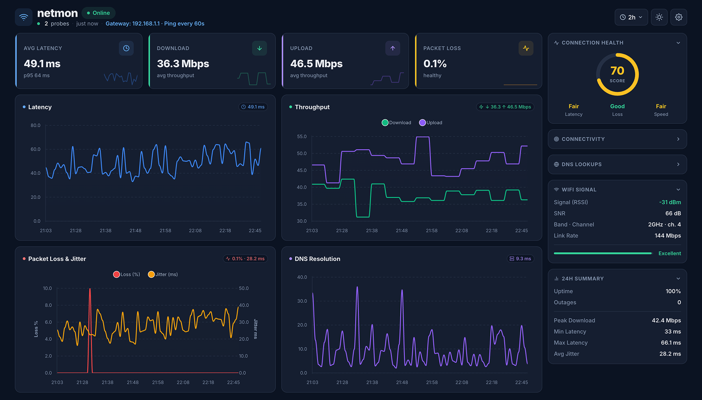
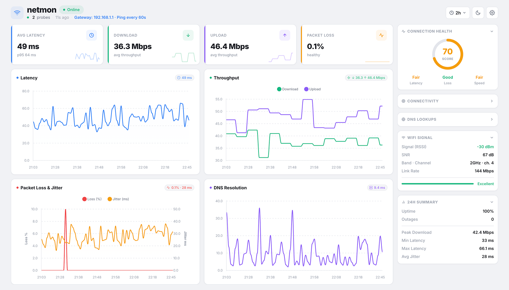

# netmon

A lightweight, self-hosted network monitoring dashboard. Tracks latency, jitter, packet loss, DNS resolution times, and bandwidth — displayed in a live web UI with no external services required.

[](https://github.com/decoded-cipher/netmon/releases/latest)
[](https://goreportcard.com/report/github.com/decoded-cipher/netmon)
[](go.mod)
[](LICENSE)
[](https://golang.org)

<p align="center">
  
  
</p>


## Features

- **Live dashboard** — auto-refreshing charts for latency, throughput, packet loss, jitter, and DNS
- **Connection info** — records WiFi and ethernet metrics per measurement (RSSI, SNR, noise, channel, band, link rate, duplex); works on macOS, Linux, and Windows
- **Network change detection** — automatically detects Wi-Fi/network switches and tags measurements per network; works on macOS, Linux, Windows, Docker, and Raspberry Pi
- **Settings UI** — configure ping targets, DNS targets, and intervals directly from the dashboard; changes persist across restarts
- **`config.json`** — file-based defaults loaded at startup; overridden by any settings saved via the UI
- **No CGO** — pure-Go SQLite driver, stdlib HTTP server; no C compiler required to build or run
- **Lightweight** — pings every 60s, speed test every 30min (1 MB); negligible network overhead
- **SQLite storage** — no database server; data persists in a single file
- **Cross-platform** — runs on Linux (x86, ARM/Pi), macOS, Windows, and Docker


## Quick Start

### Download a release

Pre-built binaries for Linux, macOS, and Windows are available on the [Releases](https://github.com/decoded-cipher/netmon/releases) page.

| Platform | Download |
|----------|----------|
| macOS (Apple Silicon) | `netmon_darwin_arm64.tar.gz` · `netmon_darwin_arm64.dmg` |
| macOS (Intel) | `netmon_darwin_amd64.tar.gz` · `netmon_darwin_amd64.dmg` |
| Linux x86-64 | `netmon_linux_amd64.tar.gz` |
| Linux ARM64 | `netmon_linux_arm64.tar.gz` |
| Linux ARMv7 (Raspberry Pi 2/3/4/5) | `netmon_linux_armv7.tar.gz` |
| Linux ARMv6 (Raspberry Pi 1/Zero) | `netmon_linux_armv6.tar.gz` |
| Windows x86-64 | `netmon_windows_amd64.zip` |
| Windows ARM64 | `netmon_windows_arm64.zip` |

```bash
# example: Linux amd64
curl -LO https://github.com/decoded-cipher/netmon/releases/latest/download/netmon_linux_amd64.tar.gz
tar -xzf netmon_linux_amd64.tar.gz
./netmon
```

### Docker (recommended)

```bash
docker run -d \
  --name netmon \
  --network host \
  -v netmon-data:/data \
  ghcr.io/decoded-cipher/netmon:latest

# create the volume first if it doesn't exist
docker volume create netmon-data
```

Or with Docker Compose:

```bash
docker compose -f infra/docker-compose.yml up -d
```

Then open **http://localhost:8080**.

### Build from source

Requires Go 1.21+ and Node.js 18+ — no C compiler needed.

```bash
git clone https://github.com/decoded-cipher/netmon.git
cd netmon
make build
./netmon
```

### Makefile targets

```
make build      # build Vue frontend then compile binary → ./netmon
make ui         # build Vue frontend only → web/dist
make run        # build frontend + run via go run
make dmg        # build binary and package as a macOS DMG → dist/netmon.dmg
make clean      # remove binary, database, and web/dist
make vet        # run go vet on all packages
make docker     # build Docker image
make docker-run # build + run Docker container
```


## Configuration

Settings are resolved in this order — each step overrides the previous:

1. **`config.json`** — edit this file to set your own defaults (loaded at startup)
2. **Settings UI** — changes saved via the dashboard are persisted in SQLite and take priority over the file

| Setting | Default | Description |
|---------|---------|-------------|
| Ping targets | `google.com`, `cloudflare.com` | Hosts to measure latency/loss against |
| DNS targets | `google.com`, `cloudflare.com` | Hosts to measure DNS resolution time |
| Ping interval | `60s` | How often to run a ping cycle |
| Speed test interval | `30m` | How often to test download/upload |
| Speed test size | `1 MB` | Payload size (kept small to avoid hogging the link) |
| HTTP port | `:8080` | Dashboard address |


## Architecture

```
cmd/netmon/          Entry point — wires packages, starts HTTP server
config.json          Default configuration (overridden by UI settings saved to DB)
internal/
  monitor/           Ping + speed workers (concurrent, 60s / 30m intervals)
  network/           Cross-platform gateway detection, SSID, and connection info (RSSI, SNR, etc.)
  server/            HTTP handler, JSON API response types
  store/             SQLite layer — schema.sql, queries.sql, UPSERT patterns, aggregation queries
web/
  src/               Vue 3 source — components, composables, and utilities
  vite.config.js     Vite build config
  dist/              Built frontend (generated by `make ui`, embedded into binary at build time)
```

**Data flow:**
1. `pingWorker` pings all targets concurrently, resolves DNS, detects network — saves a `Measurement` row every 60s
2. `speedWorker` downloads/uploads 1 MB to Cloudflare every 30 min — updates latest bandwidth values
3. Dashboard polls `GET /api/data` every 15s and renders charts client-side


## Platforms

| Platform | Tested | Notes |
|----------|--------|-------|
| macOS (Apple Silicon / Intel) | Yes | Native binary + DMG |
| Linux x86-64 | Yes | Includes Docker |
| Linux ARM64 (Raspberry Pi 3/4/5 64-bit) | Yes | Pre-built `netmon_linux_arm64` |
| Linux ARMv7 (Raspberry Pi 2/3/4/5 32-bit) | Yes | Pre-built `netmon_linux_armv7` |
| Linux ARMv6 (Raspberry Pi 1/Zero) | Yes | Pre-built `netmon_linux_armv6` |
| Windows | Partial | Ping parsing works; SSID detection via `netsh` |
| Docker | Yes | See `infra/Dockerfile` and `infra/docker-compose.yml` |

### Raspberry Pi

Pre-built binaries are available for all Pi generations — download the right one from the [Releases](https://github.com/decoded-cipher/netmon/releases) page:

| Pi model | Binary |
|----------|--------|
| Pi 1, Zero, Zero W | `netmon_linux_armv6.tar.gz` |
| Pi 2, 3, 4, 5 (32-bit OS) | `netmon_linux_armv7.tar.gz` |
| Pi 3, 4, 5 (64-bit OS) | `netmon_linux_arm64.tar.gz` |

Or cross-compile from source:

```bash
# ARMv7 (Pi 2/3/4/5 running a 32-bit OS)
GOOS=linux GOARCH=arm GOARM=7 go build -o netmon ./cmd/netmon

# ARMv6 (Pi 1 / Zero)
GOOS=linux GOARCH=arm GOARM=6 go build -o netmon ./cmd/netmon

# ARM64 (Pi 3/4/5 running a 64-bit OS)
GOOS=linux GOARCH=arm64 go build -o netmon ./cmd/netmon
```


## Requirements

- **Go 1.21+** for building from source
- **Node.js 18+** for building the frontend (`make ui` / `make build`)
- `ping` available in `PATH` at runtime (standard on all platforms)
